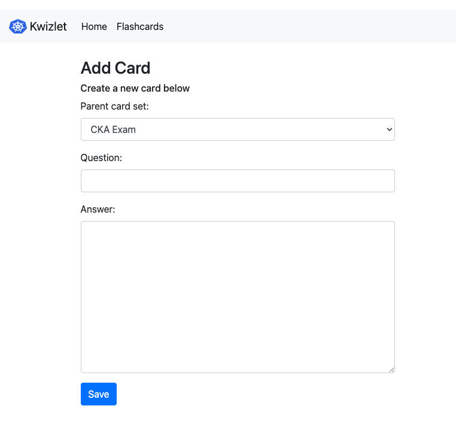

# Kwizlet Flashcard App

## Kwizlet is a configurable flashcard application created with Django.

### Kwizlet Features
- Create new flashcard sets to save to a database.
- Edit card decks.
- Add cards to decks.
- Study flashcards by flipping through the cards to see questions and answers.

### Installation
1. Clone this repo:

   ```
   git clone https://github.com/maryfrances01/kwizlet.git
   ```

2. Create your virtual environment:

   ```
   python3 -m venv venv
   ```
   ```
   source venv/bin/activate
   ```

3. Install the required packages using:

   ```
   pip3 install -r requirements.txt
   ```

4. Setup the SQLite database:

   ```
   python3 manage.py makemigrations
   ```
   ```
   python3 manage.py migrate
   ```
5. (Optional) Import the CKA exam flashcard set:

   ```
   python3 manage.py loaddata db.json
   ```

6. Start your development web server:

   ```
   python3 manage.py runserver
   ```

7. (Optional) Create a new flashcard set by entering the following URL in your browser:

   ```
   http://127.0.0.1:8000/flashcards/create/
   ```

### Screenshots

<br>

<br>

<br>

